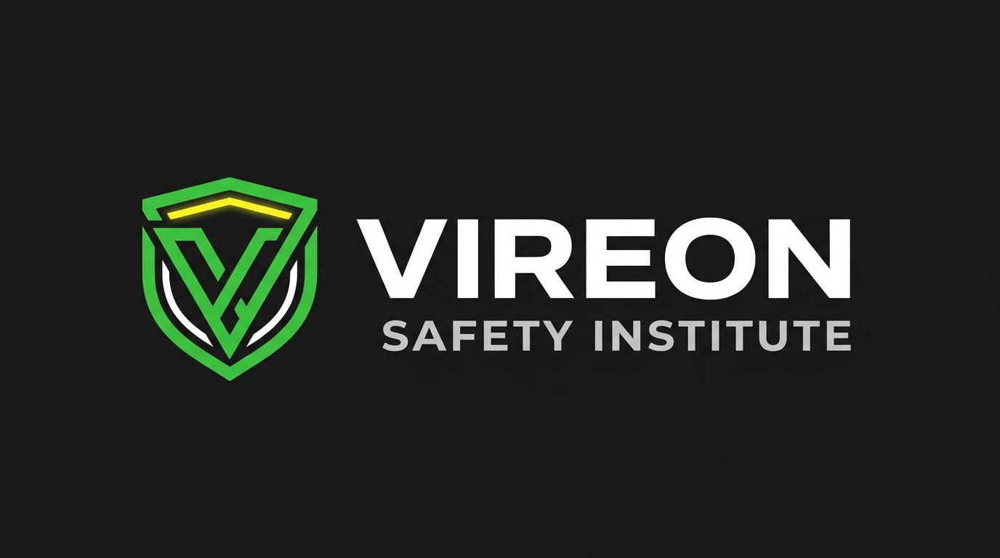

# VIREON — Safety Institute Website

<p align="center">
  
</p>

<p align="center">
  
</p>

<p align="center">
  
  
  
  
</p>

---

## Overview

**VIREON** is a polished, conversion-focused institute website for industrial safety education.  
It highlights programs, placements, student success stories, leadership, certifications, and direct lead capture.

---

## Client Project Coverage

This project includes the complete public-facing flow a client institute needs:

1. **Brand + trust**: logo, certifications, authority sections.
2. **Programs showcase**: course categories, details, and CTA-driven structure.
3. **Placement engine**: animated placed-students cards with real student photos.
4. **Social proof**: testimonials + leadership profile sections.
5. **Engagement blocks**: gallery, FAQ, and quick inquiry forms.
6. **Mobile-first behavior**: responsive layout, navigation, smooth interaction.

---

## Main Sections Implemented

- Hero (`#home`)
- Certifications (`#certifications`)
- Features (`#features`)
- Leadership (`#leadership`)
- Programs (`#programs`)
- Placement Stats (`#placements`)
- Placed Students Showcase (`#placed-showcase`)
- Gallery (`#gallery`)
- Testimonials (`#testimonials`)
- FAQ (`#faq`)
- Contact (`#contact`)

---

## Project Structure

```text
vireon/
├── index.html
├── README.md
└── Main/
    ├── css/
    │   └── style.css
    ├── js/
    │   └── main.js
    ├── images/
    │   ├── anwar-ali.jpg
    │   ├── Vicky kr Yadav.jpeg
    │   ├── Ravindra Prasad.jpeg
    │   ├── Diwakar Chaudhary.jpeg
    │   ├── Ankit kr Yadav.jpeg
    │   ├── Vickey Kr Verma.jpeg
    │   ├── Suraj kr Pandit.jpeg
    │   ├── Suman Kumar.jpeg
    │   ├── Rakesh Rajak.jpeg
    │   ├── Kaushal kr Yadav.jpeg
    │   └── Arjun Singh .jpeg
    └── screen.png
```

---

## Student Placement Photo Integration

The placement cards are now set up with **rectangular, proper-fit photo boxes** for better visibility (not DP style).  
Cards auto-scroll in the showcase and include duplicated entries for seamless looping.

To add/update a student photo:

1. Put image in `Main/images/`
2. Add/update card image in `index.html` with:
   ```html
   <div class="placed-card-photo">
     
   </div>
   ```
3. Keep styling managed from `Main/css/style.css` under `.placed-card-photo` and `.placed-card-photo img`

---

## Run Locally

This is a static website.

1. Clone/download repository
2. Open `index.html` in browser

For best development workflow, use VS Code Live Server.

---

## Key UX/Interaction Highlights

- Smooth animated section reveals
- Sticky responsive navigation
- Infinite horizontal placement slider
- Mobile-friendly touch layout
- Conversion-oriented CTA placement
- Accessible semantic structure with labels/ARIA hooks

---

## Screenshots

Add/update screenshots in `Main/screen.png` (or more images) and embed below:

```md

```

---

## Tech Stack

- **HTML5**
- **CSS3** (custom animations + responsive breakpoints)
- **Vanilla JavaScript** (UI behavior and interactions)

---

## Maintainer Notes

If this is reused for other institute clients:

- Replace logo and institute identity in `Main/images/`
- Update contact/address/phone in `index.html`
- Replace student image files and placement card names
- Adjust color theme from CSS root variables in `Main/css/style.css`
